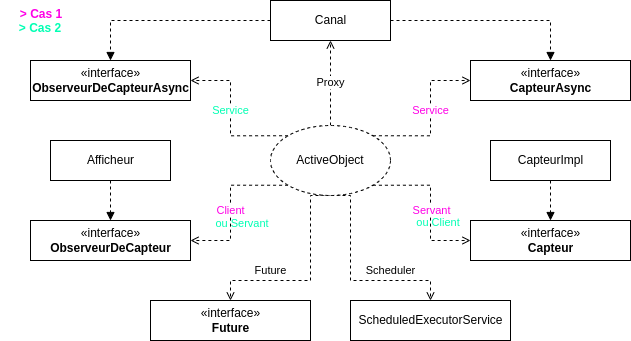
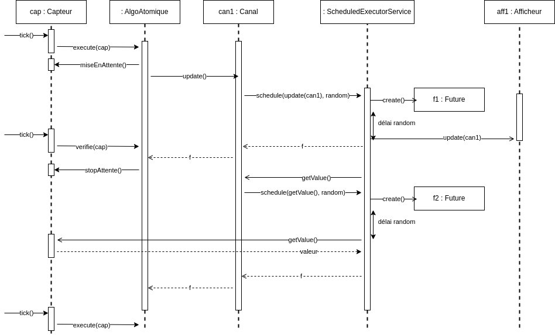

CHAPUIS Emma - M2 ILA

# TP Observer Parallèle

Le but du TP était d'adapter un système de communication entre capteur et afficheurs à un fonctionnement asynchrone à l'aide du patron de conception ActiveObject. On pouvait ensuite appliquer les stratégies de diffusion atomique, séquence et époque.

Le code de mon projet suit le fonctionnement shématisé dans le diagramme UML et le diagramme de séquence ci-dessous :

J'ai pu programmer la mise en place du PC ActiveObject, l'application de la stratégie de diffusion atomique ainsi que les tests pour cette stratégie.